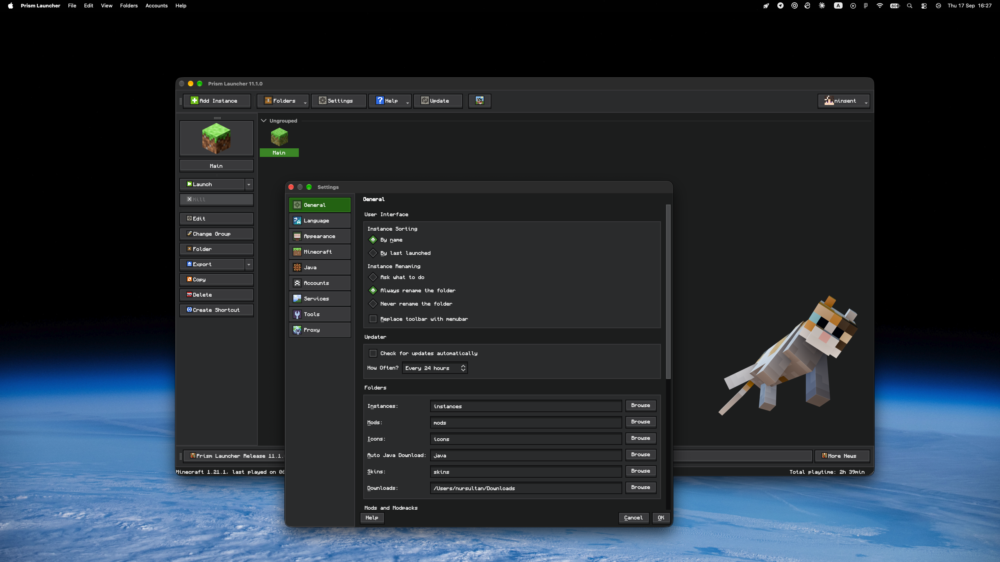

# Ore UI theme for Prism Launcher

Minecraft-inspired dark theme for Prism Launcher with vibrant emerald, diamond, amethyst accents.

---

## Preview

## Font
All Ore UI themes use [Monocraft](https://github.com/IdreesInc/Monocraft), a pixel font inspired by the Minecraft typeface. It is bundled in the [Ore UI - Font (Monocraft)](Ore%20UI%20-%20Font%20(Monocraft)/) folder.

Install `Monocraft.ttf` from that folder before applying a theme, then restart Prism Launcher. Without it the launcher falls back to your system monospace font. See the folder's [README](Ore%20UI%20-%20Font%20(Monocraft)/README.md) for per-platform install steps and optional weights.

Monocraft is made by Idrees Hassan and distributed under the SIL Open Font License 1.1.
